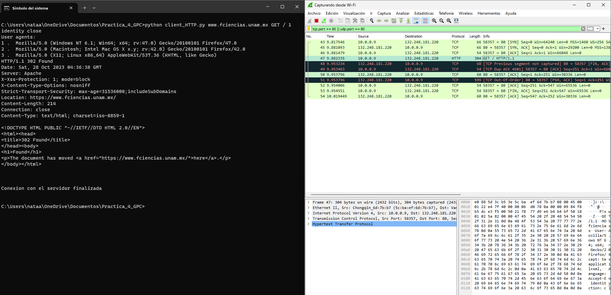
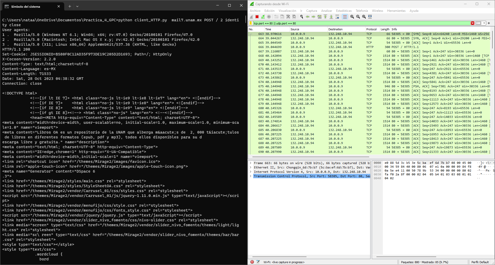
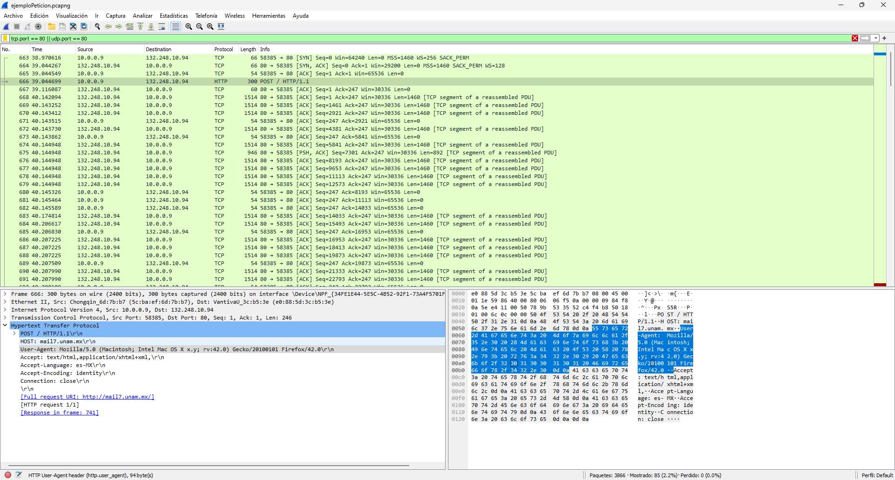
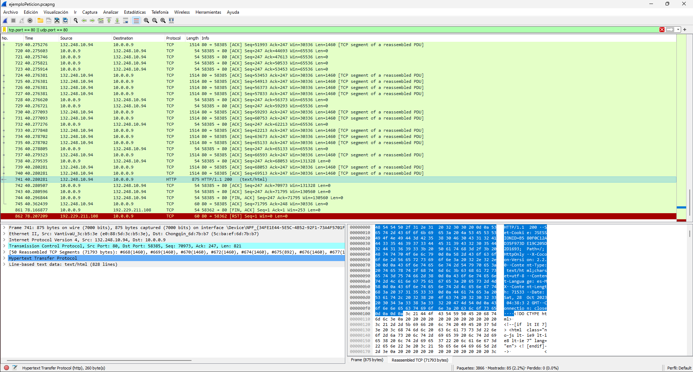
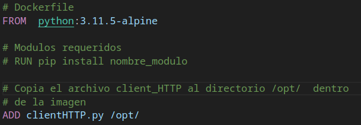

# Taller de Sistemas Operativos, Redes de Cómputo, Sistemas Distribuidos y Manejo de Información

# Práctica 4: _Programación de un cliente de HTTP y uso de contenedores_.
Equipo:

Natalia Abigail Pérez Romero 

Marco Antonio Rivera Silva

## Desarrollo

### Primera parte

1. Programar un cliente de HTTP versión 1.1 con el lenguaje de programación Python 3, se hará sin el uso de módulos complementarios como *httplib* o alguno parecido, aunque si será necesario usar otros módulos como *socket* y *sys*. El cliente podrá establecer la conexión con cualquier servidor Web usando el protocolo HTTP.

2. La solicitud HTTP de un cliente a un servidor, al menos la solicitud enviada al servidor por el programa cliente deberá incluir los siguientes parámetros:

  * Método, URL y versión del protocolo HTTP, por ejemplo
  `GET /imagen.jpg HTTP/1.1`. Los dos primeros valores, el método y la URL, los proporcionará el usuario del programa.
  * Host, proporcionado por el usuario.
  * User-Agent, proporcionado por el usuario a partir de una lista de opciones.
  * Accept, este valor puede ser fijo
  * Accept-Charset, este valor puede ser fijo
  * Accept-Encoding, proporcionado por el usuario.
  * Accept-Language, este valor puede ser fijo
  * Connection, proporcionado por el usuario.

3. El programa final recibirá al menos seis argumentos cuando se ejecute, de la forma

`$ python clientHTTP.py host http_method url user_agent encoding connection`

en donde

  * `host`, corresponde a la dirección IP del servidor HTTP o a su nombre de dominio, por ejemplo www.fciencias.unam.mx.
  * `http_method`, corresponde al método de HTTP que se usará para enviar la solicitud al servidor, para este cliente solamente se usarán los métodos *HEAD* o *GET*.
  * `url`, corresponde al archivo o recurso solicitado al servidor web, por ejemplo */* para directorio raiz, o *imagen.jpg*.
  * `user_agent`, tendrá tres opciones numeradas del 1 al 3, cada opción corresponderá a un *user agent* diferente definido por el programador.
  * `encoding`, corresponde al parámetro de la solicitud de la codificación de la respuesta, por ejemplo *gzip*, *deflate* o *identity*.
  * `connection`, se refiere a la forma del establecimiento de la conexión, por ejemplo *keep-alive* o *close*.

 Por ejemplo:

 `$ python clientHTTP.py www.fciencias.unam.mx GET / 1 identity close`  

4. Los parámetros deben de separarse por un retorno de carro o *carriage return*, (CR) y por un salto de línea o *linefeed* (LF), y la solicitud de HTTP debe de terminar de la misma forma con un retorno de carro y con un salto de línea. 

5. En la siguiente figura se muestra el tráfico de Wireshark del ejemplo anterior. Del lado izquierdo de la salida de los datos de Wireshark se encuentra los valores en hexadecimal de estos datos, y del lado derecho se encuentra su interpretación en código ASCII, si la interpretación no corresponde a un caracter imprimible, Wireshark colocará un punto. 

En el archivo Practica_4_GPC/ejemploPeticion.pcapng podemos encontrar la captura de la petición `$ python clientHTTP.py www.fciencias.unam.mx GET / 2 identity close`  
 si ponemos el filtro tcp.port == 80 || udp.port == 80 

6. La respuesta HTTP enviada por el servidor deberá ser mostrada por el cliente en pantalla (en la terminal en donde se ejecutó el cliente). Puede ser sólo la respuesta HTTP en algunos casos, y en otros la respuesta HTTP junto con el archivo solicitado, ambos en pantalla. 

Por ejemplo, si ejecutamos `$ python clientHTTP.py mail7.unam.mx POST / 2 identity close` obtenemos lo siguiente:

Observamos la respuesta HTTP junto con el archivo solicitado en la terminal, y la conversación realizada a traves de Wireshark

En la captura siguiente podemos observar la petición HTTP:

En la captura siguiente podemos observar la respuesta HTTP:s

7. Incluimos una función sencilla de ayuda que muestre cómo se debe de ejecutar el programa y las opciones de *User-Agent* con las que se cuenta.

Si se ejecuta sin argumentos presentará un menu donde aceptará la entrada de los 6 campos e instrucciones para ejecutar el programa
 `$ python clientHTTP.py`  

8. Algunos sitios web que se pueden consultar por HTTP (puerto 80), que se pueden usar para probar este cliente:

* mail7.unam.mx
* encomunicacionct.geociencias.unam.mx
* cirrus.dcaa.unam.mx
* www.mundonano.unam.mx
* www.pued.unam.mx
* tikhonov.fciencias.unam.mx

### Segunda parte

1. Se subio el código al repositorio de GitHub: https://github.com/NataliaPerez08/Practica_4_GPC.git junto con la configuración para que se ejecute manualmente dentro de un contenedor de Docker con todas las dependencias y configuraciones necesarias. 

2. El archivo Dockerfile `Dockerfile`, contiene las instrucciones necesarias para la construcción de la imagen. A continuación se muestra la imagen de Docker lista para ejecutar el código base del cliente de HTTP del ejemplo `clientHTTP_base.py`.

3. Para probar si la construcción de la imagen es correcta siga los siguientes pasos. Instale Docker, si se está usando como sistema operativo a Debian, siga las instrucciones para instalar Docker de la documentación oficial en el siguiente enlace

https://docs.docker.com/engine/install/debian/#install-using-the-repository

4. Descargue los archivos de su repositorio, clonando el mismo.

5. Ingrese al directorio recién descargado y ejecute el siguiente comando para construir la imagen de docker:

`$ sudo docker build -t nombre_de_la_imagen:etiqueta .`

Reemplace el *nombre_de_la_imagen* con el nombre que desea darle a la imagen, y *etiqueta* con una etiqueta o versión. El punto al final del comando significa que Docker debe buscar el Dockerfile en el directorio actual. Por ejemplo:

`$ sudo docker build -t redes:p4 .`

7. Verifique que la imagen fue construida listando las imágenes con el siguiente comando:

`$ sudo docker image ls`

8. Una vez que la imagen se haya construido con éxito, ejecute un contenedor basado en la imagen recién creada con el siguiente comando, y que además le permitirá interactuar con una shell dentro del contenedor:

`$ sudo docker run --interactive --tty redes:p4 /bin/sh`

9. Ahora ejecutar el programa de python clientHTTP.py con el siguiente comando:

`# python /opt/clientHTTP.py`

O bien con los 6 paramentros de la forma: 

`# python /opt/clientHTTP.py host http_method url user_agent encoding connection` 

Por ejemplo:

`# python /opt/clientHTTP.py www.fciencias.unam.mx GET / 2 identity close`

10. Salga del contenedor con la combinación de teclas `ctrl`+`d`

## Evaluación

1. Elabore el reporte en el archivo *README.md* de su repositorio de código, indicando la forma de ejecutar su programa junto con algunos ejemplos diferentes el correcto funcionamiento de su programa. Además, incluya las respuestas a lo siguiente:

* ¿Cuál es la función de los métodos de HTTP *HEAD*, *GET*, *POST*, *PUT* y *DELETE*?
* ¿Investigue y enliste junto con su significado las categorías de códigos de estado que usa HTTP?
* ¿Para qué se usan los campos *encoding* y *connection*?

# Reporte
* ¿Cuál es la función de los métodos de HTTP *HEAD*, *GET*, *POST*, *PUT* y *DELETE*?

**HEAD**. El método HEAD pide una respuesta idéntica a la de una petición GET, pero sin el cuerpo de la respuesta, es decir, solo solicita los metadatos de un recurso o archivo y no todo elemento  como tal.

**GET**. Solicita una representación de un recurso específico. Las peticiones que usan el método GET sólo deben recuperar datos.

**POST**. Envia una entidad a un recurso en específico, causando a menudo un cambio en el estado o efectos secundarios en el servidor.

**PUT**. Crea/Carga un nuevo recurso al servidor, o en caso de que el objeto ya exista en el servidor reemplaza el recurso existente con el recurso que se carga.

**DELETE**. Le solicita al servidor web que se borre un recurso en específico.

* ¿Investigue y enliste junto con su significado las categorías de códigos de estado que usa HTTP?

Los códigos de estado de respuesta HTTP indican si se ha completado satisfactoriamente una solicitud HTTP específica. Las respuestas se agrupan en cinco clases:
- Respuestas informativas (100–199),
- Respuestas satisfactorias (200–299),
- Redirecciones (300–399),
- Errores de los clientes (400–499),
- y errores de los servidores (500–599).

Los códigos de estado se definen en la sección 10 de RFC 2616. Puedes obtener las especificaciones actualizadas en RFC 7231.

* ¿Para qué se usan los campos *encoding* y *connection*?

**Accept-Encoding**
La cabecera HTTP de solicitud Accept-Encoding indica la codificación del contenido (normalmente un algoritmo de compresión) que el cliente puede entender. El servidor utiliza la negociación de contenidos para seleccionar una de las propuestas e informa al cliente de esa elección con la cabecera de respuesta Content-Encoding.

Directivas:

gzip. Formato de compresión que utiliza la codificación Lempel-Ziv (LZ77) con un CRC de 32 bits.

compress. Formato de compresión que utiliza el algoritmo Lempel-Ziv-Welch (LZW).

deflate. Formato de compresión que utiliza la estructura zlib con el algoritmo de compresión deflate.

br. Formato de compresión que utiliza el algoritmo Brotli.

identity. Indica la función de identidad (es decir, sin modificación ni compresión). Este valor siempre se considera aceptable, aunque se omita.

*. Coincide con cualquier codificación de contenido que no figure ya en la cabecera. Este es el valor por defecto si la cabecera no está presente. Esta directiva no sugiere que se admita ningún algoritmo, sino que indica que no se expresa ninguna preferencia.

;q= (ponderación de valores q). Cualquier valor se coloca en un orden de preferencia expresado mediante un valor relativo de calidad denominado peso.

**Connection**
La cabecera general Connection controla si la conexión de red permanece abierta una vez finalizada la transacción actual. 

Si el valor enviado es keep-alive, la conexión es persistente y no se cierra, lo que permite realizar solicitudes posteriores al mismo servidor.

 Si el valor enviado es close, indica que el cliente o el servidor desean cerrar la conexión. 